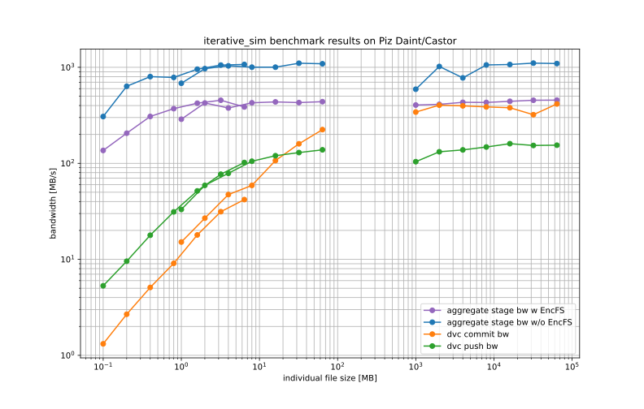

# Data version control in privacy-preserving HPC workflows using DVC, EncFS, SLURM and Openstack Swift

This project applies infrastructure-as-code principles to [DVC](https://dvc.org) and integrates it with [EncFS](https://github.com/vgough/encfs) and [SLURM](https://slurm.schedmd.com) to track results of scientific HPC workflows in a privacy-preserving manner, exchanging them via the OpenStack Swift object storage at https://castor.cscs.ch.

The **key features** extending DVC include
* SLURM integration for HPC clusters: DVC stages and their dependencies can be executed asynchronously using SLURM (`dvc repro` submits a SLURM job, `dvc commit` is run upon job completion)
* privacy-preservation: DVC stages can utilize a transparently encrypted filesystem with [EncFS](https://github.com/vgough/encfs) ensuring no unencrypted data is persisted to storage or exchanged through DVC (see [further details](async_encfs_dvc/encfs_int/README.md))
* container support: DVC stages can be run with the Docker and [Sarus](https://github.com/eth-cscs/sarus) engines such that code dependencies are tracked via Git-SHA-tagged container images, making stages fully re-executable
* infrastructure-as-code practice: DVC repository and stage structure can be encoded into reusable YAML policies, enabling different users to generate DVC stages that comply to the same workflow organization

These capabilities extend, rather than modify, DVC and can largely be used independently. The repository includes three demo applications as surrogates for workflow stages - [app_ml](app_ml) for a machine learning application, [app_sim](app_sim) for a simulation and [app_prep](app_prep) for a preprocessing step that is performed manually or automated. Each of them is accompanied by a corresponding app policy that references repository and stage policies, all of which can be customized inside a DVC repository to reflect evolving requirements. A scientific workflow may also include custom application protocols. These could be defined in an additional package (e.g. another folder on the same level als `app_...`) and imported by the participating applications. It is important to note that DVC does not have a concept for application protocols, but only tracks dependencies between files.

The next sections cover the [installation](#installation) and [usage](#usage) of the tool. Specifically, the latter introduces a series of tutorial notebooks that exemplify various use cases. For further details on usage and implementation, please consult the [dedicated documentation](usage_details.md). Finally, an overview on performance on Piz Daint and [Castor](https://castor.cscs.ch)'s object storage is attached in the [performance report](#performance-on-piz-daint-and-castor).

# Installation

The package can be installed in your Python environment with
```
pip install git+https://github.com/eth-cscs/async-encfs-dvc.git
```
This will install all dependencies except for EncFS. If encryption is required, follow the separate [installation instructions](async_encfs_dvc/encfs_int/README.md).

# Usage

A set of notebooks illustrating the usage of individual features is available in the [examples](examples) directory.

* a demonstration of DVC stage generation with infrastructure-as-code principles for a machine learning pipeline is available in the [ML repository tutorial](examples/ml_tutorial.ipynb).
* an iterative simulation workflow running with Docker containers on encrypted data can be found in the [EncFS-simulation tutorial](examples/encfs_sim_tutorial.ipynb). This workflow is also used as a [performance benchmark](benchmarks) (see [results](#performance-on-piz-daint-and-castor) below)
* a DVC workflow with asynchronous stages in SLURM and Sarus containers is available in the [SLURM tutorial](examples/slurm_async_sim_tutorial.ipynb)
* a PyTorch deep learning application that integrates the above concepts to run distributed training and inference for a [vision transfomer](examples/vit_example.ipynb) model with SLURM on encrypted data

For a step-by-step guide on setting up a DVC repository to track workflow results, (optionally) using encryption and [Castor](https://castor.cscs.ch)'s object storage as a remote, please refer to the [setup guide](setup_guide.md).

The project also includes a test suite that can be run with `tox`. If EncFS and SLURM are not installed locally, use `tox -e py39-default` to only run tests without these requirements. In contrast, to run only EncFS-tests, execute `tox -e py39-encfs` and to run only the SLURM-tests use `tox -e py39-slurm`. 


# Performance on Piz Daint and Castor

We use the `iterative_sim` [benchmark](benchmarks/iterative_sim_benchmark.sh) with and without encryption as illustrated in the [EncFS-simulation tutorial](examples/encfs_sim_tutorial.ipynb) on Piz Daint and [Castor](https://castor.cscs.ch). This benchmark creates and runs a pipeline of DVC stages that form a linear dependency graph. In contrast to the corresponding tutorial that focuses on a single node with `Docker`, every `app_sim` stage is run with `Sarus` on 8 GPU nodes and 16 ranks. Each rank writes its payload sampled from `/dev/urandom` with `dd` to the filesystem using a single thread. The aggregate output payload per DVC stage is increased in powers of 2, from 16 GB to 1.024 TB in our runs (using decimal units, i.e. 1 GB = 10^9 B). The subsequent `dvc commit` and `dvc push` commands are run on a single multi-core node. The software configuration used is available at [iterative_sim.config.md](benchmarks/results/iterative_sim.config.md) and detailed logs can be found in the `benchmarks` branch.

We use three different configurations for 
* **large files**: 1 file per rank, i.e. starting with 1 GB
* **medium-sized files**: 10^3 files per rank, i.e. starting with 1 MB
* **small files**: 10^4 files per rank, i.e. starting with 100 KB
and vary the total per-rank payload from 1 GB to 64 GB in powers of 2 (as stated above). On the `scratch` filesystem on Piz Daint, creating the 7 stages for the DVC pipeline of a single configuration takes around 18 s (irrespective of whether `EncFS` is used).

When run without encryption/`EncFS`, we obtain the following results on Piz Daint for **large files**

| individual file size | per-rank payload | aggregate payload | stage time (SLURM step) | dvc commit time (SLURM step) | dvc push time to Castor (SLURM step) |
| --------------------:| ----------------:| -----------------:| -----------------------:| ----------------------------:| ------------------------------------:|
|  1 GB                |  1 GB            |    16 GB          |   0m 27.052s            |   0m 46.797s                 |    2m 33.804s                        |
|  2 GB                |  2 GB            |    32 GB          |   0m 31.342s            |   1m 19.278s                 |    4m  2.548s                        |
|  4 GB                |  4 GB            |    64 GB          |   1m 22.411s            |   2m 41.182s                 |    7m 43.655s                        |
|  8 GB                |  8 GB            |   128 GB          |   2m  0.840s            |   5m 30.745s                 |   14m 25.279s                        |
| 16 GB                | 16 GB            |   256 GB          |   3m 59.262s            |  11m 14.833s                 |   26m 37.984s                        |
| 32 GB                | 32 GB            |   512 GB          |   7m 42.820s            |  26m 35.141s                 |   55m 34.079s                        |
| 64 GB                | 64 GB            | 1.024 TB          |  15m 35.199s            |  41m  4.529s                 |  110m 26.116s                        |

with **medium-sized files**

| individual file size | per-rank payload | aggregate payload | stage time (SLURM step) | dvc commit time (SLURM step) | dvc push time to Castor (SLURM step) |
| --------------------:| ----------------:| -----------------:| -----------------------:| ----------------------------:| ------------------------------------:|
|  1 MB                |  1 GB            |    16 GB          |   0m 23.444s            |  17m 36.499s                 |    8m  3.508s                        |
|  2 MB                |  2 GB            |    32 GB          |   0m 33.024s            |  19m 52.038s                 |    9m  2.840s                        |
|  4 MB                |  4 GB            |    64 GB          |   1m  1.768s            |  22m 33.451s                 |   13m 32.501s                        |
|  8 MB                |  8 GB            |   128 GB          |   2m  7.507s            |  36m 13.483s                 |   20m 17.103s                        |
| 16 MB                | 16 GB            |   256 GB          |   4m 15.086s            |  39m 57.099s                 |   35m 32.338s                        |
| 32 MB                | 32 GB            |   512 GB          |   7m 43.991s            |  53m 24.634s                 |   65m 55.366s                        |
| 64 MB                | 64 GB            | 1.024 TB          |  15m 40.195s            |  76m  0.389s                 |  123m 25.036s                        |

and with **small files**

| individual file size | per-rank payload | aggregate payload | stage time (SLURM step) | dvc commit time (SLURM step) | dvc push time to Castor (SLURM step) |
| --------------------:| ----------------:| -----------------:| -----------------------:| ----------------------------:| ------------------------------------:|
|   100 KB             |  1 GB            |    16 GB          |   0m 52.073s            |  202m 25.826s                |   50m 17.943s                        |
|   200 KB             |  2 GB            |    32 GB          |   0m 50.400s            |  199m  3.391s                |   55m 47.384s                        |
|   400 KB             |  4 GB            |    64 GB          |   1m 19.986s            |  209m 17.751s                |   59m 49.833s                        |
|   800 KB             |  8 GB            |   128 GB          |   2m 43.147s            |  234m 42.978s                |   68m 18.372s                        |
| 1.600 MB             | 16 GB            |   256 GB          |   4m 27.615s            |  237m 40.735s                |   82m 38.656s                        |
| 3.200 MB             | 32 GB            |   512 GB          |   8m  5.145s            |  272m 10.639s                |  110m 47.234s                        |
| 6.400 MB             | 64 GB            | 1.024 TB          |  15m 55.370s            |  407m 14.425s                |  167m 18.985s                        |

We obtain the following performance numbers for the application stage in the same configurations with encryption/`EncFS`

| per-rank payload | aggregate payload | stage time (large files) | stage time (medium files) | stage time (small files) |
| ----------------:| -----------------:| ------------------------:| -------------------------:| ------------------------:|
|  1 GB            |    16 GB          |   0m 39.529s             |   0m 55.533s              |   1m 57.455s             |
|  2 GB            |    32 GB          |   1m 17.725s             |   1m 15.242s              |   2m 35.338s             |
|  4 GB            |    64 GB          |   2m 28.160s             |   2m 49.697s              |   3m 27.868s             |
|  8 GB            |   128 GB          |   4m 57.152s             |   4m 59.661s              |   5m 44.948s             |
| 16 GB            |   256 GB          |   9m 38.297s             |   9m 46.761s              |  10m  5.082s             |
| 32 GB            |   512 GB          |  18m 47.857s             |  19m 52.775s              |  18m 47.612s             |
| 64 GB            | 1.024 TB          |  37m 27.673s             |  38m 53.677s              |  44m 10.290s             |

These results can be summarized in the following bandwith plot as a function of individual file size.



When sampling from `/dev/zero` instead of `/dev/urandom`, the write-throughput of the application stage is about 4-5x higher without encryption than with `EncFS` for large files.

Note that only one `dvc commit` or `dvc push` SLURM job can run per DVC repo at any time, while stages can run be concurrently (as long as they are not DVC dependencies of one another). If `dvc commit` or `dvc push` are throughput-limiting steps, the most effective measure is to avoid small file sizes (>= 10 MB is ideal). Besides that, one can increase the performance by running disjoint pipelines in separate clones of the Git/DVC repo. To avoid redundant transfers of large files over a slow network connection, it can be useful to synchronize over the local filesystem by adding a [local remote](https://dvc.org/doc/command-reference/remote#example-add-a-default-local-remote), e.g. with 
```shell
dvc remote add daint-local $SCRATCH/path/to/remote
```
and then 
```shell
dvc push/pull --remote daint-local <stages>
```
In this manner, the download overhead of shared dependencies can be avoided (file hashes are recomputed, however). Furthermore, to avoid long file hash recalculations (in `dvc commit`) upon small, localized changes in a very large file, try to store it as multiple separate files rather than a single very large one if it needs to be changed regularly. When e.g. using HDF5 as an application protocol, consider using external links to split the HDF5 into multiple files each containing a dataset (cf. [this discussion](https://github.com/iterative/dvc/discussions/6776)).

If these techniques do not alleviate the issue with throughput, a draft of running `dvc commit/push` operations `out-of-repo` instead `in-repo` is available (can be activated by exporting `DVC_SLURM_DVC_OP_OUT_OF_REPO=YES`). The intention is to run the computationally expensive part in e.g. `dvc commit` in a separate, temporary DVC repo with all top folders under `$(dvc root)` except `.dvc` as symbolic links to the original repo and then have a short-running process that synchronizes with the main repo. The jobs running on DVC repos outside the main one are then parallelizable. Currently, there is no speedup for `dvc commit`, though, as file hashes are recomputed on every `dvc pull` (i.e. the `cache.db`'s entries are not synchronized by a local `dvc pull`).

